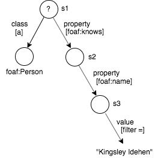
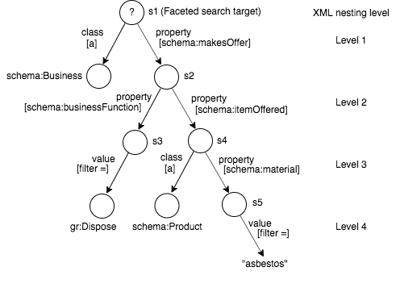

# FacetJsClient

2019-Nov-07  
CMSB

A Javascript client for the [Virtuoso Faceted Browsing Service](http://vos.openlinksw.com/owiki/wiki/VOS/VirtuosoFacetsWebService).

FacetJsClient is a Javascript interface to Virtuoso's /fct/service. It aims to be a client library with no UI dependencies with a view to it being usable by any UI framework. [FacetReactClient](https://github.com/cblakeley/FacetReactClient) provides a React-based UI to the Virtuoso Faceted Browsing Service, using FacetJsClient for its underpinnings.

See also branch [develop](https://github.com/cblakeley/FacetJsClient/tree/develop)

## Setup & Testing
A [Karma](https://karma-runner.github.io/3.0/index.html) test setup is included for testing of the library from within a browser, [Headless Chrome](https://developers.google.com/web/updates/2017/06/headless-karma-mocha-chai) in this case.

* Install the required npm modules using `npm install`.
* To run the tests:
  * Edit `test/test.conf.js` so that `fct_test_endpoint` points to the URL of your test Facet service endpoint. (Default: `http://localhost:8896/fct/service`)
  * `npm test`
* To run the tests in debug mode to allow debugging using Chrome Dev Tools debugger
  * `npm run debug`
  * Point your browser to `http://localhost:9876`, set a breakpoint then refresh the page
* To generate the JSDoc documentation
  * `npm run doc`

## General Approach

The client library includes two main classes: `FctQuery` and `FctResult`.

`FctQuery` builds an XML request body for execution by `/fct/service`. The XML request payload is described by [Faceted Browsing Service](http://vos.openlinksw.com/owiki/wiki/VOS/VirtuosoFacetsWebService). Different elements and attributes of the XML payload are created, read, updated or deleted by various `FctQuery` methods and accessors. The general approach is to use JQuery for manipulating the input XML. To submit the XML request and execute the contained query, use `FctQuery#execute`. On successful execution, `FctQuery#execute` returns a `FctResult` object.

`FctResult` holds the XML response in property `xml`. Rather than use JQuery to retrieve values from the XML, the response is also converted to a Javascript object using [JXON](https://developer.mozilla.org/en-US/docs/Archive/JXON), to allow for easy consumption by a JS client application. This Javascript object is accessible through property `json`. Different properties of the Javascript object, corresponding to different XML elements in the XML response, can be retrieved through various `FctResult` accessors.

`FctQuery#execute` actually returns a Promise which, when fulfilled, returns a `FctResult`. To trigger `FctQuery#execute` from an event handler, use something like:

```
$('button').on('click', function() {
      fctQuery.execute()      
       .then(fctResult => {
         ... display the query result ...
       })
       .catch(err => {
         $('.fct_qry_status')
           .text('The Facet query failed: ' + err.message)
           .addClass('error');
       })
    })
```

## Sparql Query Generation

Examples of Facet input XML and the corresponding generated SPARQL queries are shown below. Each nesting level in the input XML introduces a new SPARQL variable: `?s1`, `?s2` ... `?sN`, where N corresponds to the nesting level.

`?s1` identifies the set of matching entities found by the faceted search. The other `?sN` (N > 1) express the faceted search filter criteria, but aren't the primary entities being searched for.

### Example 1

**Input XML**

```
<?xml version="1.0"?>
<query xmlns="http://openlinksw.com/services/facets/1.0">
  <!-- Nesting level 1: implied variable ?s1 -->
  <class iri="http://xmlns.com/foaf/0.1/Person" />
  <property iri="http://xmlns.com/foaf/0.1/knows">
    <-- Nesting level 2: Implied variable ?s2 -->
    <property iri="http://xmlns.com/foaf/0.1/name">
       <-- Nesting level 3: Implied variable ?s3 -->
      <value>"Kingsley Idehen"</value>
    </property>
  </property>
  <view type="list" limit="100" />
</query>
```

**Query meta graph**



**Generated SPARQL query**

```
select ?s1 as ?c1  where  
{
  ?s1 a <http://xmlns.com/foaf/0.1/Person> . 
  ?s1 <http://xmlns.com/foaf/0.1/knows> ?s2 . 
  ?s2 <http://xmlns.com/foaf/0.1/name> ?s3 . 
  filter (?s3 = "Kingsley Idehen") . 
} 
group by (?s1) 
order by desc (<LONG::IRI_RANK> (?s1))  
limit 100
```

### Example 2

**Input XML**

```
<?xml version="1.0"?>
<query xmlns="http://openlinksw.com/services/facets/1.0">
  <!-- Nesting level 1: implied variable ?s1 -->
  <class iri="http://xmlns.com/foaf/0.1/Person" />
  <property-of iri="http://xmlns.com/foaf/0.1/knows">	
    <-- Nesting level 2: Implied variable ?s2 -->
    <property iri="http://xmlns.com/foaf/0.1/name">	
      <-- Nesting level 3: Implied variable ?s3 -->
      <value>"Melvin Carvalho"</value>
    </property>
  </property-of>
  <view type="list" limit="100" />
</query>
```

**Query meta graph**


**Generated SPARQL query**

```
select ?s1 as ?c1
where
{
  ?s1 a <http://xmlns.com/foaf/0.1/Person> . 
  ?s2 <http://xmlns.com/foaf/0.1/knows> ?s1 . 
  ?s2 <http://xmlns.com/foaf/0.1/name> ?s3 . 
  filter (?s3 = "Melvin Carvalho") . 
} 
group by (?s1) 
order by desc (<LONG::IRI_RANK> (?s1))  
limit 100
```

### Example 3

**Input XML**

```
<?xml version="1.0"?>
<query xmlns="http://openlinksw.com/services/facets/1.0">
  <!-- Nesting level 1: implied variable ?s1 -->
  <class iri="http://schema.org/Business" />
  <property iri="http://schema.org/makesOffer">
    <!-- Nesting level 2: implied variable ?s2 -->
    <property iri="http://schema.org/businessFunction">
      <!-- Nesting level 3.1: implied variable ?s3 -->
      <value datatype="uri">http://purl.org/goodrelations/v1#Dispose</value>
    </property>
    <property iri="http://schema.org/itemOffered">
      <!-- Nesting level 3.2: implied variable ?s4 -->
      <class iri="http://schema.org/Product" />
      <property iri="http://schema.org/material">
        <!-- Nesting level 4: implied variable ?s5 -->
        <value>"asbestos"</value>
      </property>
    </property>
  </property>
  <view type="list" limit="100" />
</query>
```

**Query meta graph**



**Generated SPARQL query**

```
select ?s1 as ?c1  where  {
  ?s1 a <http://schema.org/Business> . 
  ?s1 <http://schema.org/makesOffer> ?s2 . 
  ?s2 <http://schema.org/businessFunction> ?s3 . 
  filter (?s3 = <http://purl.org/goodrelations/v1#Dispose>) . 
  ?s2 <http://schema.org/itemOffered> ?s4 .
  ?s4 a <http://schema.org/Product> . 
  ?s4 <http://schema.org/material> ?s5 . 
  filter (?s5 = "asbestos") . 
} 
group by (?s1) 
order by desc (<LONG::IRI_RANK> (?s1))  
limit 100 
```

## DTD for Facet Service Input XML
```
<!ELEMENT query (text?,class*,property*,property-of*,value?,view?,cond?)>

<!ELEMENT text (#PCDATA)>

<!ELEMENT class EMPTY>

<!ELEMENT property (class*|property*|property-of*|value?|view?)>

<!ELEMENT property-of (class*|property*|property-of*|value?|view?)>

<!ELEMENT value (#PCDATA)>

<!-- 
When element <value> occurs as a child of property-of, it 
must be datatype 'uri' (xsd:anyURI). The subject of the property to 
which 'property-of' refers must be an entity (a resource), not a 
literal; so the value's type must be 'uri'. This element has the 
effect of constraining the entity's URI to the specified value.
-->

<!ELEMENT view EMPTY>

<!-- 
Element <view> may occur as a child of a <query>, <property> or 
<property-of> element but may occur only once in the document.
<view> specifies which subject is presented in the result set.
-->

<!ATTLIST query
  graph CDATA #IMPLIED
  timeout CDATA #IMPLIED
  inference CDATA #IMPLIED
  same-as CDATA #IMPLIED
>

<!ATTLIST view
  type (classes|geo|geo-list|list|list-count|
        properties|properties-in|propval-list|text|text-d|text-properties) #REQUIRED
  limit CDATA #IMPLIED
  offset CDATA #IMPLIED
>

<!ATTLIST text
  property CDATA #IMPLIED
>

<!ATTLIST text-d
  property CDATA #IMPLIED
>

<!ATTLIST class
  iri CDATA #IMPLIED
  exclude yes #IMPLIED
  inference CDATA #IMPLIED
>

<!ATTLIST property
  iri CDATA #REQUIRED
  same_as yes #IMPLIED
  inference CDATA #IMPLIED
>

<!ATTLIST property-of
  iri CDATA #REQUIRED
  same_as yes #IMPLIED
  inference CDATA #IMPLIED
>

<!--
 -- value and cond perform similar functions.
 -->

<!ATTLIST value
  datatype CDATA #IMPLIED
  xml:lang CDATA #IMPLIED
  op (=|<|>|<=|>=) "="
>

<!ATTLIST cond
  datatype CDATA #IMPLIED
  xml:lang CDATA #IMPLIED
  op (=|<|>|<=|>=) "="
  neg 1 #IMPLIED
>
```