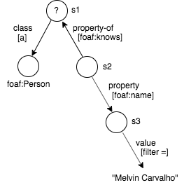
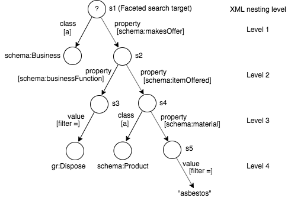

# FacetJsClient - API

2021-Feb-09  
CMSB

A Javascript client for the [Virtuoso Faceted Browsing Service](http://vos.openlinksw.com/owiki/wiki/VOS/VirtuosoFacetsWebService).

FacetJsClient is a Javascript interface to Virtuoso's /fct/service. It aims to be a client library with no UI dependencies with a view to it being usable by any UI framework. [FacetReactClient](https://github.com/cblakeley/FacetReactClient) provides a React-based UI to the Virtuoso Faceted Browsing Service, using FacetJsClient for its underpinnings.

See also:

  * Source code: [GitHub: FacetJsClient](https://github.com/OpenLinkSoftware/FacetJsClient/tree/master)

### Contents

[General Approach](#general-approach)  
[Sparql Query Generation](#sparql-query-generation)  
[DTD for the Facet Service Input XML](#dtd)  
[API Overview](#api-overview)  

## <a name="general-approach"></a>General Approach

The client library includes two main classes: `FctQuery` and `FctResult`.

`FctQuery` builds an XML request body for execution by `/fct/service`. The XML request payload is described by [Faceted Browsing Service](http://vos.openlinksw.com/owiki/wiki/VOS/VirtuosoFacetsWebService). Different elements and attributes of the XML payload are created, read, updated or deleted by various `FctQuery` methods and accessors. The general approach is to use JQuery for manipulating the input XML. To submit the XML request and execute the contained query, use `FctQuery#execute`. On successful execution, `FctQuery#execute` returns a `FctResult` object.

`FctResult` holds the XML response in property `xml`. Rather than use JQuery to retrieve values from the XML, the response is also converted to a Javascript object using [JXON](https://developer.mozilla.org/en-US/docs/Archive/JXON), to allow for easy consumption by a JS client application. This Javascript object is accessible through property `json`. Different properties of the Javascript object, corresponding to different XML elements in the XML response, can be retrieved through various `FctResult` accessors.

`FctQuery#execute` actually returns a Promise which, when fulfilled, returns a `FctResult`. To trigger `FctQuery#execute` from an event handler, use something like:

```
$('button').on('click', function() {
      fctQuery.execute()      
       .then(fctResult => {
         ... display the query result ...
       })
       .catch(err => {
         $('.fct_qry_status')
           .text('The Facet query failed: ' + err.message)
           .addClass('error');
       })
    })
```

## <a name="sparql-query-generation"></a>Sparql Query Generation

Examples of Facet input XML and the corresponding generated SPARQL queries are shown below. Each nesting level in the input XML introduces a new SPARQL variable: `?s1`, `?s2` ... `?sN`, where N corresponds to the nesting level.

`?s1` identifies the set of matching entities found by the faceted search. The other `?sN` (N > 1) express the faceted search filter criteria, but aren't the primary entities being searched for.

### Example 1

**Input XML**

```
<?xml version="1.0"?>
<query xmlns="http://openlinksw.com/services/facets/1.0">
  <!-- Nesting level 1: implied variable ?s1 -->
  <class iri="http://xmlns.com/foaf/0.1/Person" />
  <property iri="http://xmlns.com/foaf/0.1/knows">
    <-- Nesting level 2: Implied variable ?s2 -->
    <property iri="http://xmlns.com/foaf/0.1/name">
       <-- Nesting level 3: Implied variable ?s3 -->
      <value>"Kingsley Idehen"</value>
    </property>
  </property>
  <view type="list" limit="100" />
</query>
```

**Query meta graph**


**Generated SPARQL query**

```
select ?s1 as ?c1  where  
{
  ?s1 a <http://xmlns.com/foaf/0.1/Person> . 
  ?s1 <http://xmlns.com/foaf/0.1/knows> ?s2 . 
  ?s2 <http://xmlns.com/foaf/0.1/name> ?s3 . 
  filter (?s3 = "Kingsley Idehen") . 
} 
group by (?s1) 
order by desc (<LONG::IRI_RANK> (?s1))  
limit 100
```

### Example 2

**Input XML**

```
<?xml version="1.0"?>
<query xmlns="http://openlinksw.com/services/facets/1.0">
  <!-- Nesting level 1: implied variable ?s1 -->
  <class iri="http://xmlns.com/foaf/0.1/Person" />
  <property-of iri="http://xmlns.com/foaf/0.1/knows">	
    <-- Nesting level 2: Implied variable ?s2 -->
    <property iri="http://xmlns.com/foaf/0.1/name">	
      <-- Nesting level 3: Implied variable ?s3 -->
      <value>"Melvin Carvalho"</value>
    </property>
  </property-of>
  <view type="list" limit="100" />
</query>
```

**Query meta graph**



**Generated SPARQL query**

```
select ?s1 as ?c1
where
{
  ?s1 a <http://xmlns.com/foaf/0.1/Person> . 
  ?s2 <http://xmlns.com/foaf/0.1/knows> ?s1 . 
  ?s2 <http://xmlns.com/foaf/0.1/name> ?s3 . 
  filter (?s3 = "Melvin Carvalho") . 
} 
group by (?s1) 
order by desc (<LONG::IRI_RANK> (?s1))  
limit 100
```

### Example 3

**Input XML**

```
<?xml version="1.0"?>
<query xmlns="http://openlinksw.com/services/facets/1.0">
  <!-- Nesting level 1: implied variable ?s1 -->
  <class iri="http://schema.org/Business" />
  <property iri="http://schema.org/makesOffer">
    <!-- Nesting level 2: implied variable ?s2 -->
    <property iri="http://schema.org/businessFunction">
      <!-- Nesting level 3.1: implied variable ?s3 -->
      <value datatype="uri">http://purl.org/goodrelations/v1#Dispose</value>
    </property>
    <property iri="http://schema.org/itemOffered">
      <!-- Nesting level 3.2: implied variable ?s4 -->
      <class iri="http://schema.org/Product" />
      <property iri="http://schema.org/material">
        <!-- Nesting level 4: implied variable ?s5 -->
        <value>"asbestos"</value>
      </property>
    </property>
  </property>
  <view type="list" limit="100" />
</query>
```

**Query meta graph**



**Generated SPARQL query**

```
select ?s1 as ?c1  where  {
  ?s1 a <http://schema.org/Business> . 
  ?s1 <http://schema.org/makesOffer> ?s2 . 
  ?s2 <http://schema.org/businessFunction> ?s3 . 
  filter (?s3 = <http://purl.org/goodrelations/v1#Dispose>) . 
  ?s2 <http://schema.org/itemOffered> ?s4 .
  ?s4 a <http://schema.org/Product> . 
  ?s4 <http://schema.org/material> ?s5 . 
  filter (?s5 = "asbestos") . 
} 
group by (?s1) 
order by desc (<LONG::IRI_RANK> (?s1))  
limit 100 
```

## <a name="dtd"></a>DTD for the Facet Service Input XML
```
<!ELEMENT query (text?,class*,property*,property-of*,value?,view?,cond?)>

<!ELEMENT text (#PCDATA)>

<!ELEMENT class EMPTY>

<!ELEMENT property (class*|property*|property-of*|value?|view?)>

<!ELEMENT property-of (class*|property*|property-of*|value?|view?)>

<!ELEMENT value (#PCDATA)>

<!-- 
When element <value> occurs as a child of property-of, it 
must be datatype 'uri' (xsd:anyURI). The subject of the property to 
which 'property-of' refers must be an entity (a resource), not a 
literal; so the value's type must be 'uri'. This element has the 
effect of constraining the entity's URI to the specified value.
-->

<!ELEMENT view EMPTY>

<!-- 
Element <view> may occur as a child of a <query>, <property> or 
<property-of> element but may occur only once in the document.
<view> specifies which subject is presented in the result set.
-->

<!ATTLIST query
  graph CDATA #IMPLIED
  timeout CDATA #IMPLIED
  inference CDATA #IMPLIED
  same-as CDATA #IMPLIED
>

<!ATTLIST view
  type (classes|geo|geo-list|list|list-count|
        properties|properties-in|propval-list|text|text-d|text-properties) #REQUIRED
  limit CDATA #IMPLIED
  offset CDATA #IMPLIED
>

<!ATTLIST text
  property CDATA #IMPLIED
>

<!ATTLIST text-d
  property CDATA #IMPLIED
>

<!ATTLIST class
  iri CDATA #IMPLIED
  exclude yes #IMPLIED
  inference CDATA #IMPLIED
>

<!ATTLIST property
  iri CDATA #REQUIRED
  same_as yes #IMPLIED
  inference CDATA #IMPLIED
>

<!ATTLIST property-of
  iri CDATA #REQUIRED
  same_as yes #IMPLIED
  inference CDATA #IMPLIED
>

<!--
 -- value and cond perform similar functions.
 -->

<!ATTLIST value
  datatype CDATA #IMPLIED
  xml:lang CDATA #IMPLIED
  op (=|<|>|<=|>=) "="
>

<!ATTLIST cond
  datatype CDATA #IMPLIED
  xml:lang CDATA #IMPLIED
  op (=|<|>|<=|>=) "="
  neg 1 #IMPLIED
>
```

## <a name="facet-input-xml-notes"></a>Facet Input XML Notes

### View Element

As mentioned above, each nesting level in the input XML introduces a new SPARQL variable: `?s1`, `?s2` ... `?sN`, where N corresponds to the nesting level. A `<query>`, `<property>` or `<property-of>` element equates to a subject-arc pair:

<code>s<sub>N</sub></code> -- (query) -->    
<code>s<sub>N</sub></code> -- (property) -->   
<code>s<sub>N</sub></code> -- (property-of) -->  

in the 'metagraph' described by the Facet input XML.

The single `<view>` element allowed in the input XML can be a child of `<query>`, `<property>` or `<property-of>`. The position of the `<view>` element implicitly specifies which <code>s<sub>N</sub></code> is presented in the result set by causing the Facet server to adjust the select list of the query described by the XML. The result set can then serve as a 'pick list' for setting filters on <code>s<sub>N</sub></code> to further refine the search for the set of entities identified by <code>s<sub>1</sub></code>. The result set, when seen as a 'pick list', comprises sets of property values from which a user can choose to constrain a property to a particular value or range, to narrow a search. The position of the `<view>` element then also identifies the <code>s<sub>N</sub></code> that should have the current focus in the Facet UI when adding or removing filters, i.e. which subject node any filters added will be applied to.

## <a name="api-overview"></a>API Overview

A summary of the classes and methods supported by the API is shown below. For details of each method, see the [class links](index.html) in the sidebar at the top of the page.

A short description of the effect of some elements is given. For a detailed description of each element refer to [Faceting Browsing Service](http://vos.openlinksw.com/owiki/wiki/VOS/VirtuosoFacetsWebService).

##### API Naming Conventions
	
Where FctQuery methods manipulate or return information about the input XML, the method naming tries, as far as possible, to use the following conventions for consistency:
	
* add{Element}, remove{Element} : adds or removes an XML element.
* get{Element} : gets information about an XML element.    
* set{Element}{Attribute}, clear{Element}{Attribute} : sets (or adds) or removes an XML element attribute.
* get{Element}{Attribute} : gets information about an XML element attribute.

The `<query>`, `<property>` and `<property-of>` elements introduce implicit query subjects and have some attributes in common. Methods for manipulating these attributes, and methods relating to these subjects, use *Subject* as the element component of the method name.

### FctQuery

[constructor](./FctQuery.html#FctQuery) 

#### Service Endpoint

[getServiceEndpoint](./FctQuery.html#getServiceEndpoint)  
[setServiceEndpoint](./FctQuery.html#setServiceEndpoint)

#### Search Execution

[execute](./FctQuery.html#execute)

#### Search Input XML Manipulation

##### Query Element

`<query>` -  The top level element in the Facet search XML.

###### Query Element Attributes

[getQueryGraph](./FctQuery.html#getQueryGraph)  
[clearQueryGraph](./FctQuery.html#clearQueryGraph)  
[setQueryGraph](./FctQuery.html#setQueryGraph)  

[getQueryTimeout](./FctQuery.html#getQueryTimeout)  
[clearQueryTimeout](./FctQuery.html#clearQueryTimeout)  
[setQueryTimeout](./FctQuery.html#setQueryTimeout)   

##### Text Element

`<text>` specifies the text which matching entities must contain.

[getText](./FctQuery.html#getText)    
[removeText](./FctQuery.html#removeText)  
[addText](./FctQuery.html#addText)  

###### Text Element Attributes
  
[getTextProperty](./FctQuery.html#getTextProperty)  
[clearTextProperty](./FctQuery.html#clearTextProperty)  
[setTextProperty](./FctQuery.html#setTextProperty)  

##### View Element

`<view>` specifies which subject in the query is described by the resultset and what information about the subject is returned.

[getViewSubjectIndex](./FctQuery.html#getViewSubjectIndex)  
[setViewSubjectIndex](./FctQuery.html#setViewSubjectIndex)  

[getViewDescription](./FctQuery.html#getViewDescription)  

##### View Element Attributes

[getViewLimit](./FctQuery.html#getViewLimit)  
[setViewLimit](./FctQuery.html#setViewLimit)  

[getViewOffset](./FctQuery.html#getViewOffset)  
[setViewOffset](./FctQuery.html#setViewOffset)  

[getViewType](./FctQuery.html#getViewType)  
[setViewType](./FctQuery.html#setViewType) 

##### Value Element

`<value>` constrains the value of a subject property or a subject IRI.

[addValue](./FctQuery.html#addValue)  
[getValueAsTurtle](./FctQuery.html#getValueAsTurtle)    

##### Cond Element

`<cond>`, like `<value>`, constrains the value of a property.

[removeSubjectConditions](./FctQuery.html#removeSubjectConditions)  
[addCondition](./FctQuery.html#addCondition)

##### Class Element

`<class>` specifies that entities being searched for must be instances of this class.

[addClass](./FctQuery.html#addClass)  

##### Class Element Attributes

[getClassIri](./FctQuery.html#getClassIri)  
[setClassIri](./FctQuery.html#setClassIri)   

[getClassExclude](./FctQuery.html#getClassExclude)  
[removeClassExclude](./FctQuery.html#removeClassExclude)  
[setClassExclude](./FctQuery.html#setClassExclude)  

[getClassInference](./FctQuery.html#getClassInference)  
[removeClassInference](./FctQuery.html#removeClassInference)  
[setClassInference](./FctQuery.html#setClassInference)  

##### Subject Nodes

The `<query>`, `<property>` and `<property-of>` elements introduce implicit query subjects and act as containers for child elements specifying conditions that apply to the implicit subject. 

[addProperty](./FctQuery.html#addProperty)  
[addPropertyOf](./FctQuery.html#addPropertyOf)   

[getSubjectCount](./FctQuery.html#getSubjectCount)  

[clearSubjectInference](./FctQuery.html#clearSubjectInference)  
[getSubjectInference](./FctQuery.html#getSubjectInference)  
[setSubjectInference](./FctQuery.html##setSubjectInference)      

[clearSubjectSameAs](./FctQuery.html#clearSubjectSameAs)  
[getSubjectSameAs](./FctQuery.html#getSubjectSameAs)    
[setSubjectSameAs](./FctQuery.html#setSubjectSameAs)   

#### Filters

Filters are some form of search constraint. The following elements introduce a filter:

`<query>`, `<class>`, `<cond>`, `<property>`, `<property-of>`, `<text>`, `<value>`

Filter descriptors are SPARQL-like subject + predicate + object sentences which describe the filters being applied by the input XML. They provide a textual summary of the search constraints in force, i.e. the constraints on facets of entities being searched. These textual descriptors are intended for use in a UI.

[queryFilterDescriptors](./FctQuery.html#queryFilterDescriptors)  
[removeFilter](./FctQuery.html#removeFilter)    
[removeFilters](./FctQuery.html#removeFilters)  

#### Helpers

##### XML Tree to XML Markup Conversion
 
[toXml](./FctQuery.html#toXml) 

##### jQuery Object Retrieval

These methods return a jQuery object referencing one or more  elements in the input XML tree.

[getElementQuery](./FctQuery.html#getElementQuery)  
[getElementSubject](./FctQuery.html#getElementSubject)  
[getElementSubjectParent](./FctQuery.html#getElementSubjectParent)  
[getElementsSubjectConditions](./FctQuery.html#getElementsSubjectConditions)  

### FctResult

[constructor](./FctResult.html#FctResult)  
[json](./FctResult.html#json)  
[sparql](./FctResult.html#sparql)  
[xml](./FctResult.html#xml) 

### FctError

[constructor](./FctError.html#FctError)

### JXON

[constructor](./JXON.html#JXON)  
[build](./JXON.html#build)  
[unbuild](./JXON.html#unbuild)  


